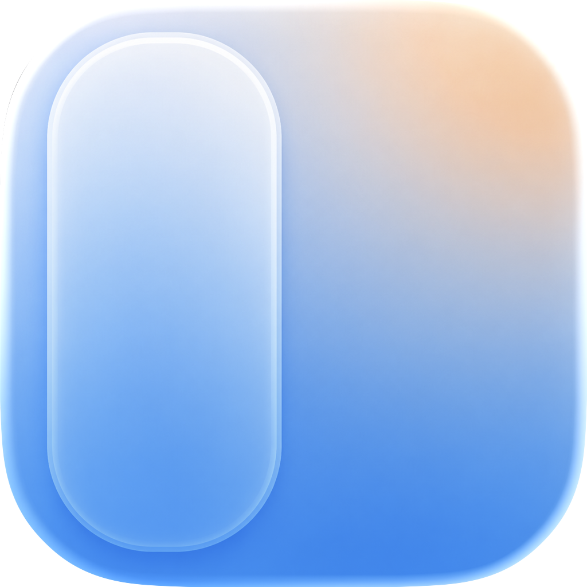
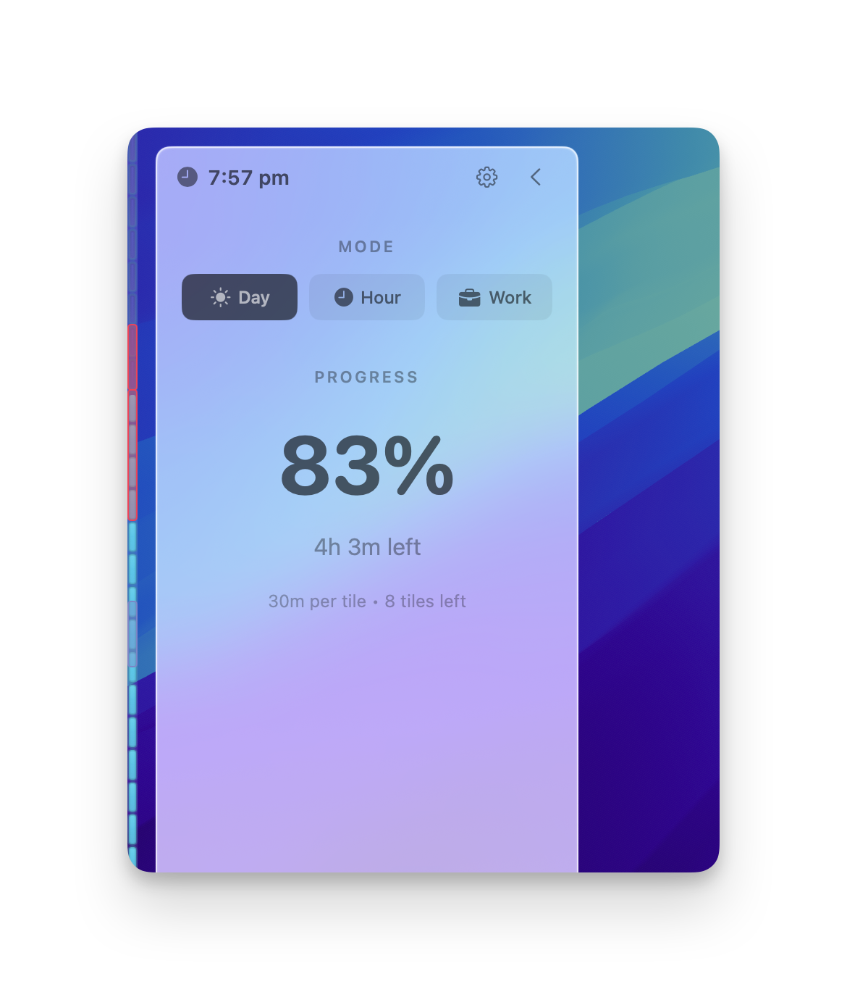
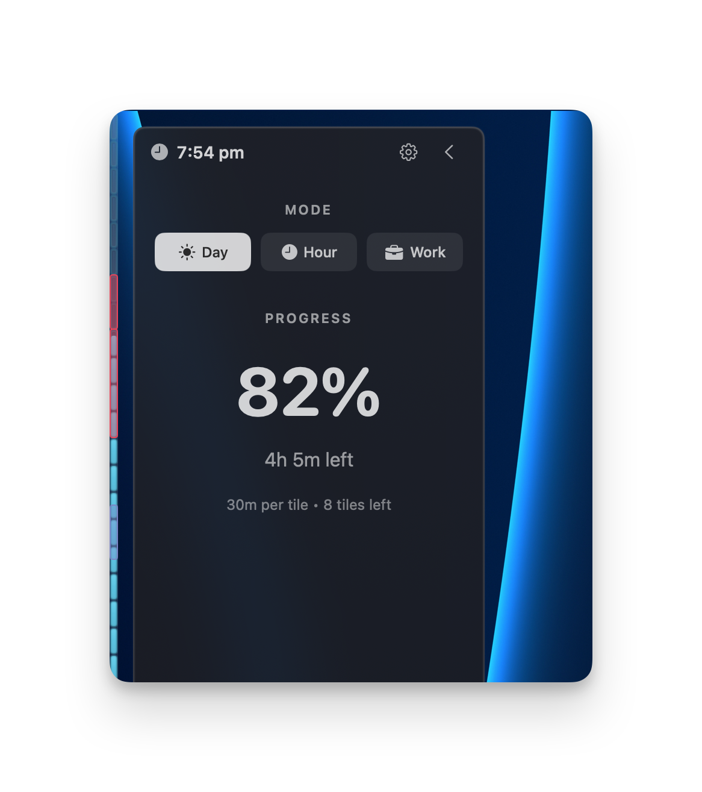
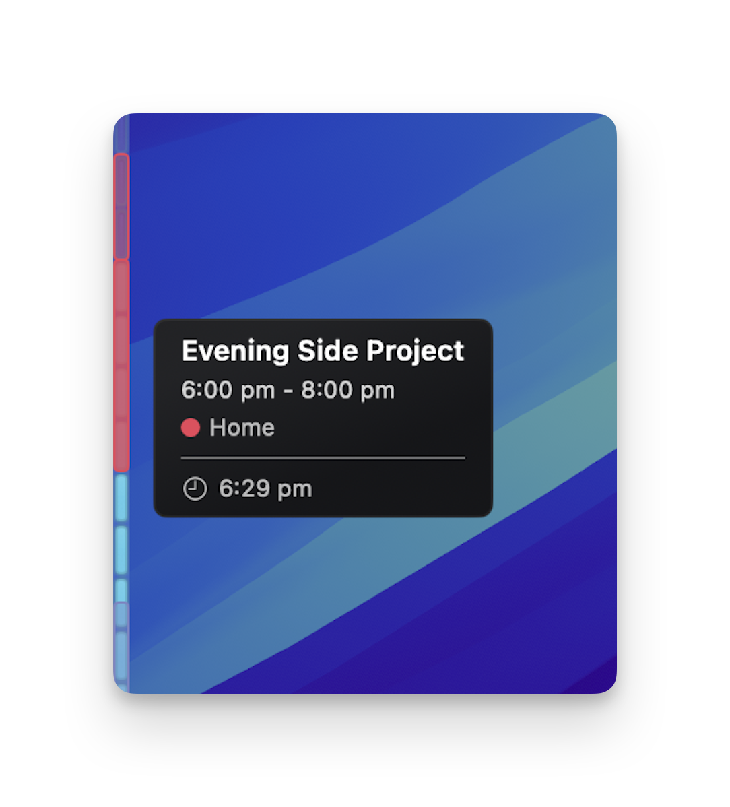

# SideTime

### Ambient time awareness for macOS

**[Visit the website →](https://katrinaading.github.io/SideTime/)**  ·  **[Download for Mac →](https://github.com/KatrinaaDing/SideTime-Releases/releases/latest)**

---

SideTime shows a quiet progress bar along the edge of your Mac, so you can *feel* how much of your day, hour, or work session has passed — without timers, logging, or interruptions.

It lives at the edge of your screen, just inside your peripheral vision. A glance is enough to know where you are in the day. No starting, no stopping, no reports to read.

## Highlights

- **Edge rail, always there** — a calm vertical bar at the side of your screen that fills as time passes. Present, never demanding.
- **Day · Hour · Work** — switch between watching your whole day, the current hour, or your defined work session.
- **Calendar markers** — today's events appear right on the rail, so you can see what's coming without opening your calendar. *(Optional, with your permission.)*
- **Make it yours** — gradient, solid, or tile themes; pick the edge, color, thickness, and opacity with simple sliders. Everything updates instantly.
- **Lightweight & native** — built for macOS with Swift and SwiftUI. Smooth, responsive, and easy on memory and battery.
- **Quietly out of the way** — a small menu bar icon gives you quick controls; the rail itself is what you actually watch.

## Download & install

1. Grab the latest version from the **[Releases page](https://github.com/KatrinaaDing/SideTime-Releases/releases/latest)**.
2. Unzip the download and drag **SideTime.app** into your **Applications** folder.
3. Open SideTime. If you'd like event markers, grant Calendar access when prompted — it's entirely optional.

> If macOS asks you to confirm opening an app from outside the App Store, right-click **SideTime.app**, choose **Open**, and confirm.

**Requirements:** macOS 14.0 (Sonoma) or later · Apple Silicon and Intel Macs.

## Privacy

SideTime runs entirely on your Mac. No account, no tracking, no analytics — your data never leaves your device. Calendar events are read locally, only with your permission, and are never sent anywhere.

## Support

Questions, feedback, or a bug to report?

- **Open an issue** — [report a bug or request a feature](https://github.com/KatrinaaDing/SideTime-Releases/issues/new/choose) and we'll take a look.
- **Email us** — [ziqi.dev@outlook.com](mailto:ziqi.dev@outlook.com), usually answered within 24 hours.

## Legal

SideTime is a proprietary macOS app. The release artifacts in this repository are provided for download and installation only. No license is granted to copy, modify, redistribute, reverse engineer, or create derivative works from the app except as permitted by applicable law. The source code for SideTime is not published in this repository.

Copyright © 2026 Ziqi Ding. All rights reserved.
